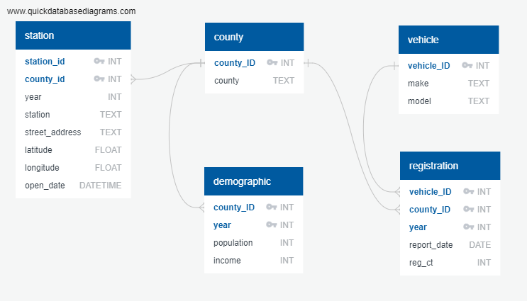

# Florida Electric Vehicle Analysis Report

## Project Members
* [Altricia Latimer](https://github.com/mrslat-creator)
* [Christina Gangi](https://github.com/cgangi2216)
* [JJ Williams](https://github.com/jjwilliams11)
* [Sam Azhari](https://github.com/flbpilot)

## Project Summary
This project looks at the increase in FL EV registrations in 2019-2020 and potential factors that contribute to this trend. We reviewed population, income, charging stations access for each county as well as environmental impacts on the state as a whole. We also found data for total FL vehicle registrations as well as an interactive map showing the impact of rising sea level on the Florida coast line. However, due to time constraints and the format of these resources, we were unable to incorporate them into the project. A possible fututre enhancment to this project would be to bring in the average cost of an EV vehicle as well as the overall cost of ownership of an EV vs gas vehicles.

## Resources
* [Florida Electric Vehicle Registrations](https://www.atlasevhub.com/materials/state-ev-registration-data/) - csv file
* [Charging Station Locations](https://developer.nrel.gov/docs/api-key/) - json api
* [County Boundaries](https://public.opendatasoft.com/explore/dataset/us-county-boundaries/table/?disjunctive.[…]junctive.state_name&sort=stusab&refine.state_name=Florida) - GeoJson
* [Zip Codes to Counties](https://data.world/niccolley/us-zipcode-to-county-state/workspace/file?filename=ZIP-COUNTY-FIPS_2018-03.csv) - csv file
* [ifvisible.js](https://github.com/serkanyersen/ifvisible.js) - JavaScrpt library

## Project Plan
1. Find Data
    * EV Registrations by county
    * Census data by county
    * Charging station locations
    * Articles on environmental impact on Florida
3. Clean & Store Data
    * Use Jupyter Notebook to clean data and run preliminary analysis and validation
    * Once clean, load data into a SQLite database
    * Move code into Python so it is easily rerun from the comand line
    

4. Access Data
    * Create a Flask app; run sql queries to pull data from SQLite; and convert to a json variable
    * Using Jinja2, in the index.html template, convert the Python json variable to a JavaScript variable
5. Filter Data
    * Use D3 to capture the user's selection from the Year and County dropdown menus
    * Use JavaScript to filter the json data as needed
6. Chart Data
    * Use JavaScript leaflet library to build an interactive map
        * Shade counties based on registrations per county
        * Plot EV charging station locations
        * On click, show population, ev registration count, & median household income
    * Use JavaScript plotly library to build interactive bar chart with the following views
        * EV registration count by county for the selected year
        * Population by county for the selected year
        * Median household income by county for the selected year
    * Use JavaScript plotly library to build pie chart of marketshare by EV vehicle modle for the selected year and county.
6. Additional Features
    * Add links to articles on environmental impact
    * Use JavaScript IfVisible library to change page title when page is idle.

## Final Analysis
